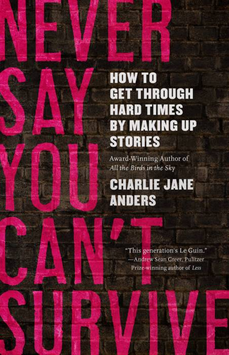

# Never Say You Can’t Survive  



“You have the power to shape worlds, and the monsters are scared of you.”

From author Charlie Jane Anders, Never Say You Can’t Survive is a how-to book about the storytelling craft, but it’s also full of memoir, personal anecdote, and insight about how to flourish in the present emergency.

---

The repository contains scripts to generate an ebook in the EPUB format from the posts at tor.com. More details at <https://www.tor.com/series/never-say-you-cant-survive-by-charlie-jane-anders/>.

The book is available for pre-order at [Amazon.com](https://www.amazon.com/Never-Say-You-Cant-Survive-ebook/dp/B08JK8XD1N) or [Indiebound](https://www.indiebound.org/book/9781250800015).

## How to run

### With Docker

```bash
docker pull captn3m0/never-say-you-cant-survive
docker run --rm --volume "$(pwd):/output" captn3m0/never-say-you-cant-survive:latest
```

The generated file will get created in your current directory.

If you are on Windows, instead run:

```
docker pull captn3m0/never-say-you-cant-survive
docker run --rm --volume "//c/:/output" captn3m0/never-say-you-cant-survive:latest
```

and the generated ebook will be created in the `C:\never-say-you-cant-survive.epub`.

### Without Docker

Dependencies: `ruby`, `wget`, `pandoc`

```
git clone https://github.com/captn3m0/never-say-you-cant-survive.git
cd never-say-you-cant-survive
bundle install
./generate.sh
```

Your generated ebook should be available at never-say-you-cant-survive.epub

## Contents

<details><summary>Section I - Introduction</summary><ol>
<li>How To Make Your Own Imaginary Friends</li>
<li>Imposter Syndrome Is Just Part of Being a Writer</li>
<li>Embrace Uncertainty: The Joy of Making a Giant Mess</li>
<li>Everything Is Broken! What Should I Write About?</li>
</ol></details>

<details><summary>Section II - What’s A Story, and How Do You Find One?</summary><ol>
<li>Don’t Be Afraid to Go on Lots of First Dates With Story Ideas</li>
<li>The Secret to Storytelling? Just One Good Scene, and Then Another, and Another.</li>
<li>The Most Powerful Thing a Story Can Do Is Show How People Change</li>
<li>A Good Plot Is Made Out of Two Things</li>
<li>How to Tell a Thrilling Story Without Breaking Your Own Heart</li>
<li>The Ending Is The Beginning</li>
</ol></details>

<details><summary>Section III - Your Feelings are Valid—and Powerful</summary><ol>
<li>Hold On To Your Anger. It’s a Storytelling Goldmine</li>
<li>People Are Only as Interesting as Their Relationships</li>
<li>One Easy Way to Feel Better About the World</li>
<li>Revision Is the Process of Turning Fake Emotion Into Real Emotion</li>
<li>Twelve Ways to Keep the Fun of Writing Alive</li>
</ol></details>

<details><summary>Section IV - What We Write About When We Write About Spaceships</summary><ol>
<li>How to Write a Political Story Without Falling on Your Face</li>
<li>Good Worldbuilding Shows How Things Could Be Different</li>
<li>The Unexamined Story Is Not Worth Writing</li>
<li>Weirdness Gives Me the Strength To Keep Going</li>
<li>When Is It Okay To Write About Someone Else’s Culture or Experience?</li>
</ol></details>

<details><summary>Section V: How to Use Writerly Tricks to Gain Unstoppable Powers</summary><ol>
<li>Find Your Voice and Make It LOUD</li>
<li>A Strong Narrator Can Help You Weave a Spell of Protection</li>
<li>When the World Goes Loopy, You Can Become a Master of Time and Space</li>
<li>Irony Doesn’t Have To Be the Enemy of Feels. They Can Team Up, In Fact!</li>
</ol></details>

## License

Licensed under the [MIT License](https://nemo.mit-license.org/). See LICENSE file for details.

## Other Projects

A list of my other EBook generation projects: <https://captnemo.in/ebooks/>.